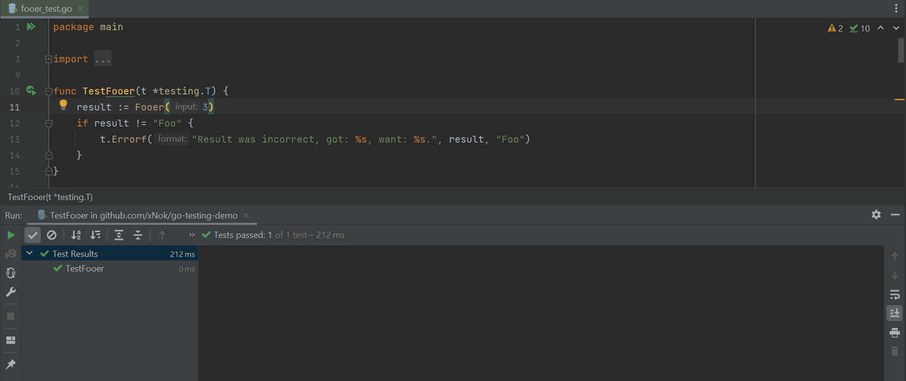
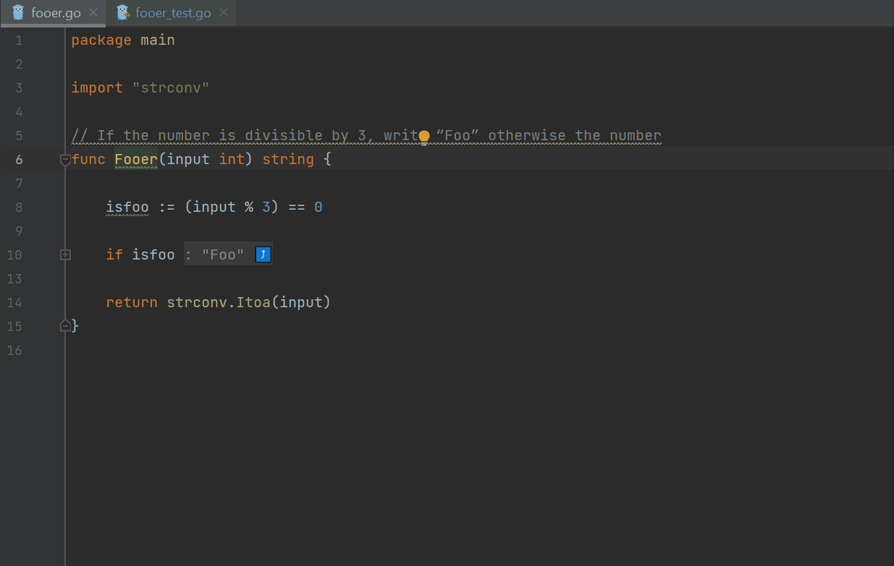

# Comprehensive Guide to Testing in Go

## Simple tests

```
func TestFooer(t *testing.T) {
	result := Fooer(3)
	if result != "Foo" {
		t.Errorf("Result was incorrect, got: %s, want: %s.", result, "Foo")
	}
}
```

Running a simple test



## Table-driven tests

```
func TestFooerTableDriven(t *testing.T) {
	// Defining the columns of the table
	var tests = []struct {
		name  string
		input int
		want  string
	}{
		// the table itself
		{"9 should be Foo", 9, "Foo"},
		{"3 should be Foo", 3, "Foo"},
		{"1 is not Foo", 1, "1"},
		{"0 should be Foo", 0, "Foo"},
	}
	// The execution lool
	for _, tt := range tests {
		t.Run(tt.name, func(t *testing.T) {
			ans := Fooer(tt.input)
			if ans != tt.want {
				t.Errorf("got %s, want %s", ans, tt.want)
			}
		})
	}
}
```
Generating table driven test:



## The testing package

```
func TestFooer2(t *testing.T) {
	input := 3
	result := Fooer(3)

	t.Logf("The input was %d", input)

	if result != "Foo" {
		t.Errorf("Result was incorrect, got: %s, want: %s.", result, "Foo")
	}

	t.Fatalf("Stop the test now, we have seen enough")

	t.Error("This won't be executed")
}
```

### Parallel Test

```
func TestFooerParallel(t *testing.T) {
	t.Run("Test 3 in Parallel", func(t *testing.T) {
		t.Parallel()
		result := Fooer(3)
		if result != "Foo" {
			t.Errorf("Result was incorrect, got: %s, want: %s.", result, "Foo")
		}
	})

	t.Run("Test 7 in Parallel", func(t *testing.T) {
		t.Parallel()
		result := Fooer(7)
		if result != "7" {
			t.Errorf("Result was incorrect, got: %s, want: %s.", result, "7")
		}
	})
}
```

## Skipping tests

```
func TestFooerSkiped(t *testing.T) {
	if testing.Short() {
		t.Skip("skipping test in short mode.")
	}

	result := Fooer(3)
	if result != "Foo" {
		t.Errorf("Result was incorrect, got: %s, want: %s.", result, "Foo")
	}
}
```

## Benchmark Tests

```
func BenchmarkFooer(b *testing.B) {
	for i := 0; i < b.N; i++ {
		Fooer(i)
	}
}
```

## Fuzz Tests

```
func FuzzFooer(f *testing.F) {
	f.Add(3)
	f.Fuzz(func(t *testing.T, a int) {
		Fooer(a)
	})
}
```

## Using Testify 

func TestFooerWithTestify(t *testing.T) {

	// assert equality
	assert.Equal(t, "Foo", Fooer(0), "0 is divisible by 3, should return Foo")

	// assert inequality
	assert.NotEqual(t, "Foo", Fooer(1), "1 is not divisible by 3, should not return Foo")
}

func TestMapWithTestify(t *testing.T) {

	// require equality
	require.Equal(t, map[int]string{1: "1", 2: "2"}, map[int]string{1: "1", 2: "3"})

	// assert equality
	assert.Equal(t, map[int]string{1: "1", 2: "2"}, map[int]string{1: "1", 2: "2"})
}
